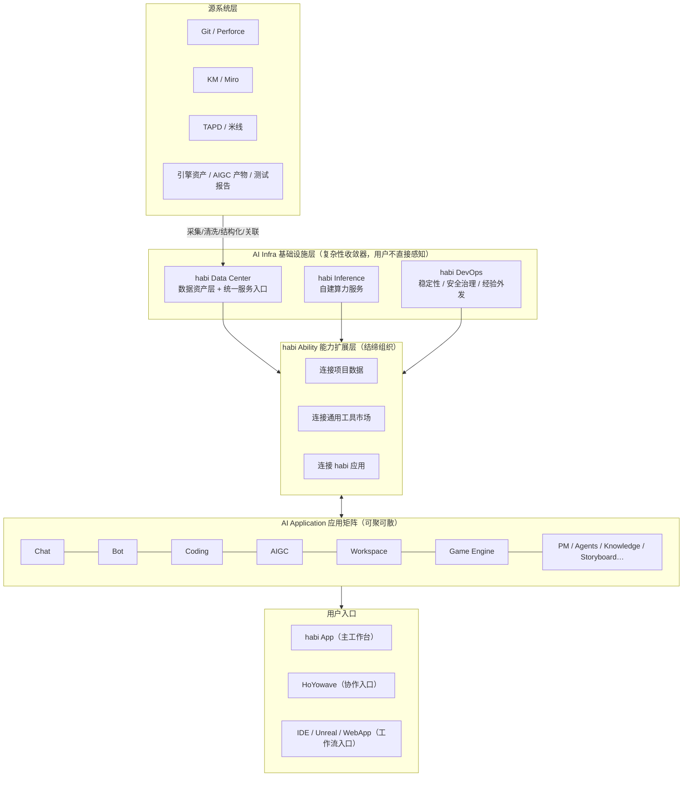
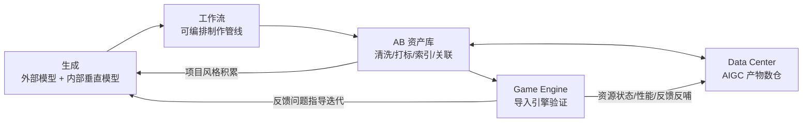

# habi 产品设计全景

> 基于 habi 官方文档体系（主文档 + 10 篇专题子文档，KM: mhco6t9g5jey）整理分析，2026-07-30。 本文是综合性描述文档；各组件的详细专题笔记见 `.context/notes/habi-*.md`。

---

## 1. 产品概述

### 1.1 什么是 habi

habi（全称 HabilynX）是 AI Engine 团队下统一的 AI 品牌，面向游戏研发的 AI 生态。

它不是一个或几个通用工具，而是一个两层生态：**向下**沉淀高质量项目数据、自建算力与生产级运维（AI Infra），**向上**承载覆盖游戏研发全场景的 AI 应用矩阵（AI Application）。所有应用共享同一套底座，应用之间相互打通，让 AI 在真实研发流程中持续沉淀、规模化复用。

官方口号：**单点可用，全生态更强；应用开放生长，底座持续沉淀。**

### 1.2 为什么做 habi：解决两个问题

**问题一：单点创新易，长期服务难**。公司内部各团队已经在不同方向沉淀了不少 AI 能力（AI 问答、AI 编程、AIGC 资产生成、引擎内 Agents、项目机器人、AI PM、个人 Agents）。基于商业模型、开源框架和现成工具，任何项目组都能快速做出单点 AI 应用——habi 鼓励这种单点创新。但当这些应用要进入真实项目、长期服务研发团队、理解项目上下文、复用项目数据、稳定支撑多人协作时，背后需要一套持续建设的底层能力：**AI Native 的高质量项目数据、自建 AI 算力服务、生产级运维保障**。这三件事单个应用都做不好、也不该各自重复做。

**问题二：能力越多，认知与接入成本越高**。分散的 AI 能力各自解决具体问题，却散落成互不相通的入口——用户要分辨该用哪个、记住一堆内部代号，还要为不同能力反复对接系统、维护配置、处理多套权限。

habi 的答案：把这些分散能力统一到一个清晰的品牌和生态之下，共享同一套底层数据、算力与运维。对用户来说只需记住一个入口——**habi 就是游戏研发 AI 能力的统一入口**。

### 1.3 核心定位：一套底座，可聚可散

| 维度 | 含义 |
| --- | --- |
| **一套底座（前提）** | 项目数据决定 AI 是否理解业务上下文；算力服务决定 AI 能否稳定支撑复杂任务；运维保障决定 AI 能否从 demo 走向持续可用的生产服务。聚散的是应用形态，不变的是同一套数据、算力与运维。 |
| **可聚为完整生态** | 项目希望系统性接入 AI 时，habi 提供从数据、算力、运维到应用、机器人、工作流、引擎集成的一整套能力，围绕同一份项目上下文协同。 |
| **可散为单点服务** | 团队只想解决某个具体问题时，可以只用一个产品（Chat/Coding/AIGC/PM……），或通过 API/SDK 把数据、算力、应用能力接进自己的工具。即便只用单点，背后复用的仍是同一套底座。 |

habi 不是"必须全量接入才能用"的大系统，而是**可以从单点起步、逐步生长的生态**：先用单点解决眼前问题，再把项目数据持续沉淀进来，复用统一算力与运维，最后让越来越多应用围绕同一份项目数据连成一体。

---

## 2. 设计哲学：五个核心判断

通读全部文档，habi 的产品设计建立在五个相互支撑的判断之上。

### 2.1 先有数据，再有应用

AI 能力的上限不只由模型决定，更由数据决定。模型再强，如果拿不到项目上下文，或拿到的是零散、过期、未经整理的数据，就只能做通用回答和局部辅助。在模型能力趋同的时代，**数据是差异化变量**。因此 habi 的建设路径始终是：先把 Infra 做扎实，再在 Infra 之上建设和扩展应用。

### 2.2 数据复利飞轮

> 接入越多 → 数据越完整 → AI 越理解项目 → 应用效果越好 → 更多场景愿意接入 → 数据继续增长。

这不是"数据越多越好"，而是项目数据经过长期、系统的收集、清洗、结构化和关联之后形成**复利**：一次系统接入增加数据积累，一次场景打磨提升访问质量，一次治理经验沉淀服务更多项目。基础能力随时间累积，每个新应用都不必从零重建数据层——这是 habi 区别于单点工具的本质，也是 Data Center 值得长期投入的投资逻辑。

### 2.3 复杂性收敛器

habi 底座的每个组件都在收敛一类"每个应用都会重复踩的坑"：

| 组件 | 收敛的复杂性 |
| --- | --- |
| Data Center | 数据接入：系统对接、权限、清洗、结构化、关联、同步、源系统保护 |
| Inference | 算力工程：模型选择、成本、并发、排队、隔离、降级、预约、追踪 |
| DevOps | 运维治理：监控、告警、安全、审计、故障恢复、成本治理 |
| Ability | 连接：数据连接、工具接入、应用互调 |
| Workspace | 版本系统操作与凭据：Git/P4 差异、CICD 差异、敏感凭据 |

任何一个新应用接入，数据、算力、运维、连接四件事都不必从零做——这是"生态"二字的工程含义。

### 2.4 划界而非夺权

habi 全套文档最鲜明的叙事策略是**主动划清边界**，明确"不抢谁的活"：

1. **Data Center ↔ MCP**：MCP 是接入层/工具调用层（解决"接得上"），DC 是数据资产层/项目理解层（解决"真理解"）——非替代关系
2. **Ability ↔ 公司工具市场**：已有工具不重做，接入统一市场复用；habi 只补 AI Native 能力——"项目组不需要关心能力来自哪个平台"
3. **Chat ↔ Ability**：Ability 是通用能力层，所有应用可直连；Chat 只是普通用户使用 Ability 的最低门槛入口——**不是必经通道**
4. **Chat ↔ 垂直应用**：Chat 是生态中的一个应用，**不是所有应用的上级**
5. **Knowledge ↔ 项目 KM**：KM 是完整资料主载体；Knowledge 是把其中部分内容筛选整理成适合 AI 检索引用的聚焦集合
6. **Workspace ↔ UGS**：自称"UGS 的 AI Native 版本"，增量而非替代

潜台词始终如一：**habi 是来做增量的，不是来抢存量领地的。** 这是对内推广生态最重要的信任基础。

### 2.5 务实的不确定性

在全套逻辑必然的叙事中，Game Engine 文档罕见地承认不确定性：

> "AI 进入引擎之后，引擎本身会变成什么样，现在没有人能给出确定答案……这件事只能走着瞧。"

这种诚实反而强化了整个体系的可信度：能算清楚的账算清楚（数据复利、弹性算力），算不清楚的坦诚承认（引擎形态随项目实践演进）。

---

## 3. 总体架构

### 3.1 分层视图

### 3.2 操作系统类比

把 habi 比作一个操作系统，各组件的角色会更清晰：

| OS 概念 | habi 对应 | 职责 |
| --- | --- | --- |
| 文件系统 | Data Center | 数据资产的存储、组织、索引 |
| CPU 调度 | Inference | 算力资源的分配、排队、峰谷调度 |
| 进程间通信（IPC） | Ability | 应用之间、应用与数据/工具之间的连接 |
| 权限系统（sudo） | Workspace | 高危写操作（提交/构建）的凭据托管与鉴权执行 |
| 系统监控/日志 | DevOps | 稳定性、审计、成本追踪 |
| 应用软件 | 应用矩阵 | 面向具体场景的产品形态 |
| Shell/桌面 | Chat / Bot / App | 用户与系统交互的入口 |

### 3.3 应用层的两种物种

应用矩阵内部其实分化成两类：

- **入口型应用**（Chat、Bot）：轻。承接模糊需求，把任务分发给其他应用；自己不沉淀专业工作流。
- **平台型应用**（Coding、AIGC、Game Engine、Workspace）：重。自有完整工作流，既消费底座能力，也对外开放插件/共建机制。

Knowledge、Agents、PM 介于两者之间：Knowledge 是能力型组件（被各应用调用的知识源），Agents 是用户自定义的组装容器，PM 是领域数据的生产者兼消费者。

---

## 4. AI Infra：基础设施层

AI Infra 是 habi 持续投入的核心，由三部分组成。三者的共同叙事模式：**都不是"买个方案"，而是把分散在每个应用会重复踩的坑收敛成公共底座。**

### 4.1 habi Data Center：数据地基

**定位**：项目生产资料的数据资产层 + AI 应用访问项目上下文的统一服务入口。回答"AI 到底基于什么理解项目"。是 habi 生态最关键的底层资产、"先有数据再有应用"的核心承载、复利开始的地方。

**要解决的问题（单点直连的七宗罪）**：重复对接系统 / 权限鉴权散落 / 环境配置复杂 / 数据版本不一致 / 重复访问冲击源系统 / 无持续清洗结构化沉淀 / 一应用的上下文难被另一应用复用。

**与 MCP 的本质区别**：MCP 是连接管道——解决"接得上"，价值发生在一次调用中，用完即止，且直连生产系统带来分散鉴权和稳定性风险（如大批量 Perforce 操作拖垮版本服务器）。Data Center 是数据资产层——解决"真理解"，价值随使用持续累积。二者非替代关系，MCP 可作为采集管道存在，habi 建的是管道之后的沉淀层。

**对源系统的双重保护**：

1. 被动隔离：收敛鉴权/权限/审计/同步/缓存/访问频率，避免多应用重复冲击；
2. 主动减量：基于数据间关系（索引/图谱/上下文）判断真正需要的数据，拉取**最小必要集合**而非全量访问——"让 AI 取得更轻、更准、更可控"。

**七大数仓与核心能力**：

- 数据收集：代码、文档、流程、策划、美术、测试、版本变更、AIGC 产物
- 数据清洗：内容分析、变更总结、报告生成
- 结构化数仓：统一数据描述 Schema
- 语义数仓：按"含义"而非关键词检索
- 图谱数仓：实体关系查询与跨系统推理（需求↔代码↔资产↔人员↔提交↔流程）
- 代码数仓：符号、引用、索引、依赖关系
- AIGC 产物数仓：AI 生成资产统一管理，可检索、可复用、可二创
- **项目服务器文件系统**：基于 Linux/Bash 的云端项目文件系统服务

**统一服务入口（最易被低估的定位）**：Data Center 不只是数仓，还把数据能力服务化——项目文件统计、代码结构分析、P4 Changelist 查询、资产索引、提交前检查、文档变更摘要、需求与代码关联分析、测试报告归纳、AIGC 产物入库打标。**对 pipeline 场景尤其重要**：构建/提交/检查/发布/统计等流程不需要完整交互式 Agent，只需嵌入稳定的数据能力——用户群从"AI 应用"扩展到"项目工程流水线"。

**Linux/Bash 云端文件系统**：游戏生产环境在 Windows，但 AI 工具链/Agent/自动化脚本在 Linux/Bash 上更成熟；大型项目完整 Workspace 庞大，每个应用各自拉取成本极高。Data Center 统一维护云端文件系统：Agent 用熟悉的 Bash 干活，应用不各自拉工程，权限/版本统一控制，pipeline 可直接调用——**从"存数据"升级为"可操作的项目上下文"**。

### 4.2 habi Inference：算力底座

**定位**：公司内部可控的自部署模型算力服务。回答"用什么算、在哪里算、如何规模化地算"。

**两个出发点**：

**① 安全（根本）——系统性风险论。** Data Center 的特点是"全"：不是碎片化数据，而是持续收集清洗结构化关联后的完整项目资产。单次碎片调用泄露是**局部风险**；Data Center 级泄露是**系统性风险**（完整项目脉络、研发状态、技术路线、团队协作信息）。DC 越成功，风险敞口越大——安全和数据复利是同一枚硬币的两面。第一原则：数据始终在公司内部可控算力环境中**闭环流转**。

**② 规模（现实约束）——成本失控论。** DC 业务天然"大而全"，9 类持续高频任务（文档清洗、代码摘要、CL 总结、资产描述、语义索引、知识库更新、周期报告、历史分析、AIGC 归档打标）产生海量调用。商业模型双重不可控：成本随量线性增长 + 调用策略不完全可控，无法支撑公司级基础设施。

**开源模型判断**（文档标注【个人观点】）：以 GLM-5.2 为代表的中国开源模型已可胜任大量真实生产场景（尤其编码）。内部大多数任务的要求是"**足够强、足够稳定、足够便宜、足够安全**"而非"最强"。自部署开源从"安全妥协的备选"变为"兼顾安全/成本/可用的主力"。商业模型不退场：退至少数高难度/强推理/效果验证场景，通过**模型评测+路由机制**组合选择。

**弹性算力（经济账核心）**：DC 需求**弹性系数非常高**——历史清洗、索引重建、报告生成、批量打标、模型评测等任务不要求实时，时间窗口灵活。因此可以：**高峰期保实时 API 交互，低峰期承接 DC 批量任务，大任务预约专属算力窗口，智能弹缩动态调配**。同一套硬件服务三类需求：实时生产力（问答/编码/Agent）、DC 后台批量任务、项目级大规模任务。对比商业模型按调用计费线性增长，自建算力通过峰谷复用摊薄长期成本——**"Inference 的价值不仅在于有算力，更在于把算力用满、用稳、用得可控"**。

**模型组合（portfolio 而非单模型）**：通用语言、代码、多模态、Embedding、轻量批处理、高能力复杂任务六类。Inference 持续评测效果/成本/速度/稳定性，应用层不必重复做模型选型——"统一接口"的实际含义 = 接口统一 + 模型可替换可路由。

**核心能力**：模型推理（部署评测高质量开源模型）/ 统一接口（REST API，兼容 Codex、CC 等用法）/ 算力预约（大规模计算密集型任务的租赁、预约、批处理）。

### 4.3 habi DevOps：运维保障

（注：本组件暂无专题子文档，以下基于主文档。）

**定位**：服务运维、稳定性、监控、安全治理和实践经验沉淀。出发点朴素：让项目组用到的 AI 能力不只是"能试一下"，而是真的可以被长期信任、稳定依赖。

**核心判断**：AI 应用在 demo 阶段很容易跑通，进入真实项目后面对的问题完全不同——多人并发是否稳定、接口异常能否恢复、权限是否清晰、数据访问是否可控、成本是否可追踪、问题发生后有没有监控告警排查手段。这些不显眼的工作决定 AI 能力能不能成为生产流程的一部分。

**五大能力**：

1. **服务稳定性保障**：监控、告警、故障排查和恢复机制
2. **安全与权限治理**：统一处理权限、审计、数据访问和安全策略，降低项目组重复治理成本
3. **成本与资源管理**：跟踪模型调用、算力使用和任务成本
4. **生产实践沉淀**：持续整理模型评测、数据清洗、Agent 使用、AIGC 工作流和项目接入经验
5. **经验对外发布**：以报告、案例、最佳实践形式向项目组共享 AI Engine 内部实践成果

**独特价值**：DevOps 不只是后台保障，还承担"经验外发"职能——模型在真实任务中的能力评测、数据清洗典型 case、Agent 有效场景、AIGC 效果对比、项目接入复盘。让踩过的坑、验证过的方法成为全公司可复用的经验资产，"让更多团队在使用 AI 时少走弯路"。

---

## 5. habi Ability：能力扩展层

**定位**：habi 生态的"连接层"/结缔组织。不是产品、不是工具，而是一组被所有 habi 应用共享调用的连接机制，对应"一套底座，可聚可散"中的\*\*"连接"能力\*\*。它回答的问题是：AI 如何从"会说"变成"连得上"。

**出发点**：AI 的价值不只看模型多强，更看能连接到什么。真实研发问题从不孤立——一个需求关联策划文档/Miro 图/代码提交/P4 资产/构建流水线/Bug 记录/排期。没有 Ability，九个应用是产品矩阵；有了它，才是生态闭环。

### 5.1 三类连接

**① 连接项目数据（经 Data Center + 统一鉴权**）项目接入 DC 一次、授权一次，多个 habi 应用权限内复用同一套上下文。五个价值点：统一鉴权 / 减少重复接入 / 提升数据质量 / 保护源系统 / 增强上下文理解。关键判断：**"通过 Ability 连接到的项目数据，质量通常比应用直接访问源系统更高"**——Ability 卖的不是访问权，是 DC 沉淀后的理解权。

**② 连接通用工具市场（互补关系**）公司已有工具/MCP 服务不重做，接入统一市场复用；habi 只补 AI Native 能力（Knowledge 知识库、数据、应用编排、场景化封装），也把自身沉淀的 AI 能力反哺工具市场。"项目组不需要关心某个能力来自哪个平台。"

**③ 连接 habi 应用（应用互调）**

| 调用方 | 被调方 | 用途 |
| --- | --- | --- |
| Chat | Knowledge / DC / Workspace | 通用知识、项目上下文、版本构建状态 |
| Coding | Workspace / Game Engine | 拉版本、查变更、触发构建、引擎内验证 |
| AIGC | 产物数仓 → Game Engine | 资产入库打标 → 引擎检索导入二次加工 |
| PM | Bot / Agents / Coding | 需求排期人员上下文辅助任务理解 |
| Bot | Chat / Workspace / PM / Coding / Agents | 能力带进 HoYowave 协作场景 |
| Agents | 任意编排 | 自由组合成完整任务 |

### 5.2 五个典型场景（能力演示梯度）

从简单到复杂逐级展示：① Chat 查项目上下文（单连接）→ ② Coding 联动版本构建（双应用）→ ③ AIGC 资产进引擎（跨层流转）→ ④ Bot 在协作中触发构建失败分析（入口场景）→ ⑤ Agent 编排跨应用日报：调 PM 查进度 + Workspace 查版本 + DC 检索变更 + Knowledge 补充方法 → 生成日报推送 Bot（全连接编排）。

---

## 6. AI Application：应用矩阵

应用层始终**开放生长、欢迎共建**：应用可由 habi 团队建设，也可由项目组根据场景创造——提需求、共同开发、原型接入底座、API/SDK 接入自有工具均可。底层逻辑：**没有人比项目组更了解自己的真实业务上下文**。

### 6.1 habi Chat：自然语言主 Agent（入口型）

**定位**：面向自然语言交互的主 Agent，普通用户感知和使用 Ability 的最低门槛入口，也是 Wave（HoYowave）连接 habi 生态的重要入口。不是问答窗口，不是所有应用的总控。

**两组边界**：

- **Chat vs Ability = 应用层 vs 能力层**：所有应用都可直接用 Ability，无需经过 Chat；Chat 只是其中门槛最低、最自然的方式——**不是所有能力调用的必经通道**
- **Chat vs 垂直应用 = 协同非上下级**：不替代 Workspace/Coding/AIGC 等，负责让用户更容易发现、使用、组合这些能力，把合适的任务转交给合适的能力

**独特生态位：承接非结构化需求。** 很多研发问题一开始不是清晰的工单或标准流程，而是一段描述、一个疑问、一段讨论。Chat 承接模糊、开放、随时发生的需求，帮用户逐步澄清推进——是**需求从模糊到清晰的转化器**，再把成型任务分发给垂直应用。

**Wave 入口价值：可达性。** Wave 不受办公地点、设备环境、内外网条件、特定系统入口限制——"问题和决策不只发生在固定办公环境，AI 能力也不应只在特定平台/网络下可用"。

**关键能力**：自然语言交互（问答/总结/分析/改写/翻译/整理/拆解/草拟/会议提炼）→ **会话级能力选择**（模型/项目上下文/知识库/公司工具/特定项目/特定 Agent，按需开关，不需永久配置复杂环境）→ 项目上下文问答 → 跨应用协同。

### 6.2 habi Bot：Wave 中的 AI 应用形态（入口型）

**定位**：habi 面向 Wave 场景的 Agents Bot 体系。不是"发一句回一段"的消息机器人，而是结合 Wave 能力打造**接近原生 AI 应用级的 Bot 体验**。

**IM Bot 的先天不足与两个解法**：AI 应用需要任务状态、多步确认、上下文管理、能力配置、长任务进度、跨设备协作——纯文本扛不住。解法：**交互式消息卡片**（状态/进度/摘要/风险/确认按钮/重试入口，会话内微交互）+ **内嵌功能管理侧边栏**（能力配置/Agent 设置/任务列表/日志详情，会话旁的轻量 App 界面）。能力清单含"与 Wave 团队共建 viewport 和上下文管理"——Wave 平台侧在为 habi 做原生改造。

**三类 Bot**：

|  | 项目专属 Bot | habi 官方 Bot | 个人定制化 Bot |
| --- | --- | --- | --- |
| 面向 | 项目团队 | 所有 habi 用户 | 自建 Agent 的用户 |
| 前提 | 项目已接入 DC | 账号绑定 habi App | 在 App 中创建 Agent |
| 性质 | 项目级 AI 助手（非个人私有） | **工作机的远程遥控器** | 完全自主控制 |
| 价值 | 开箱即用，零搭建零对接 | 跨设备访问真实工作环境 | 不等官方排期，想法即 Bot |

**最亮设计：官方 Bot 把工作机变成可远程访问的 AI 服务。** 承认"真实研发环境没法全部上云"（依赖工作机环境/文件/项目目录/登录状态/工具链），解法：**不迁任务上云，让 Wave 远程触达工作机**——Wave 负责随时随地的访问入口，habi App（跑在工作机上）负责连接真实环境执行任务。

### 6.3 habi Workspace：版本管理专家（平台型）

**定位**：传统 UGS 的 AI Native 版本。三重定位：项目开发的统一工程入口（服务人）+ AI 变更理解（从"发生了什么"到"意味着什么"）+ 生态的**版本管理专家 Sub Agent**（服务应用）。

**核心跃迁：记录 → 理解**。传统工具告诉你"谁提交了什么文件"；Workspace 告诉你"这次变更意味着什么、改了哪些功能、可能影响哪些模块、和哪个需求/Bug 有关、构建失败可能是谁引入的、当前工作区怎么更新才安全"。

**凭据托管：可写生态的安全基石。** 账号/密码/token/P4 登录/工作区路径/stream 配置**绝不分散到各应用**，Workspace 集中托管：更安全（单点管理降低泄露面）、更一致（权限状态操作统一）、更易治理（集中审计追踪）、更易复用（应用不重复接入 Git/P4）。**本质：当 AI 应用要"替你动手"（提交/触发构建）而不只是"替你查询"时，权限全部收敛到 Workspace 这一个专家手里。**

**CICD 插件扩展**：项目工程实践不可标准化（构建系统/测试/发布/引擎脚本/检查规则/分支策略差异巨大），立场是"不是强行标准化，而是保留项目工程实践的基础上统一承接、被 AI 理解调用"。

**消费方拓扑**：Coding（更新/提交/diff/构建）、Game Engine（资源版本/引擎自动化）、Chat（变更问答）、Bot（Wave 查构建失败）、PM（需求-Bug-变更-负责人关联）、Agents（版本操作编进工作流）——**生态中唯一同时被最多应用调用、且唯一持有写操作凭据的应用**。

### 6.4 habi Coding：研发自动化平台（平台型）

**定位**：不做通用 AI 编程工具的重复竞争，解决通用工具进真实游戏项目的"最后一段距离"——会写代码 ≠ 懂项目怎么拉新/编译/提交/影响哪些模块。目标：让 AI **从"会写代码"走向"能完成研发任务"**。（关联群：Weavelynx 交流群）

**边界宣言：Coding ≠ 编程，= 研发自动化。** "只要任务需要 AI 理解项目上下文、生成或修改可执行内容、调用工具并进入生产流程，就属于 Coding 的服务范围。"目标用户不止程序员：策划（配置编辑器）、TA（资产检查）、PM（临时看板）、测试（用例整理）、美术（资源预览）、关卡（PCG 调试工具）。

**首发两大模式**：

- **WebApp 开发模式**（服务非程序员）：核心洞察是非专业开发者做 WebApp，难的不是"写出第一版"而是**后半段**——部署/权限/数据接入/团队分发/持续维护。提供自然语言生成 + 后端数据接入 + 权限分发 + 部署托管 + 运维更新 + 模板沉淀，让工具"从 AI 帮我写出来"到"团队可以用起来"
- **通用 Coding Agents 模式**（服务工程师及技术岗）：12 步任务链（理解需求→检索→分析→定位→编辑→运行命令→查版本→看 diff→触发构建→引擎验证→总结变更→风险提示），关键步骤人机确认

**未来垂直模式**：AI PCG / 策划配置 / Gameplay 脚本 / 工具链自动化 / 资产检查管线 / 测试验证 / 项目自定义模式。

**开放共建措辞最重**："开放不是附加能力，而是核心竞争力。"插件扩展 + **源码级共建**（唯一写进能力清单的应用）——工程实践项目间差异最大，无统一产品能预先覆盖所有工具链。

### 6.5 habi AIGC：游戏内容生产管线（平台型）

**定位**：连接模型、工作流、引擎验证和 AB 资产库的内容生产管线。关注的不只是"生成结果"，而是"生成结果如何进入项目、验证、沉淀、再复用"。**一次生成 = 一次资产积累。**

**四个"不只是"**：① 不只是图片生成——覆盖概念/角色/场景/道具/材质/贴图/3D/动画/动作/表情/视频/分镜/运行时效果；② 不只是接外部模型——外部模型（快速吸收行业最强）+ 内部垂直模型（3D/动作/表情/项目风格）双轨；③ 不只是单步生成——工作流承载完整制作流程；④ 不只是一次性输出——AB 资产库沉淀。

**工作流具体化（角色资产 13 步）**：需求描述→风格参考→多轮概念图→选定方向→局部修改→三视图→模型原型→材质→骨骼绑定→动作→导入引擎→查看表现→继续迭代。工作流价值：保留中间参数、过程可追踪、成功流程可复用、资产从生成起即可管理。

**核心洞察：AIGC 进游戏研发的真实门槛是工程合规**——"图片看起来好，不代表模型能用；模型生成出来，也不代表材质、骨骼、性能和资源规范都符合项目要求。"门槛不在生成质量，而在规范/性能/绑定/资源标准，必须靠引擎验证 + 工作流解决。

**AB 资产库**：收录范围**不止 AIGC 产物，还包括 habi 其他应用产生的相关资产和中间产物**——AB 库是生态级统一内容资产层。处理：清洗/去重/分类/打标/元数据/语义索引/来源记录/版本关联/项目关联/使用记录。产出：可检索、可复用、可迭代、可二创的长期资产 + 项目风格沉淀。

**运行时效果探索（独立未来线）**：AI 光照/AI 渲染/AI 表情/AI 动作/AI 驱动角色表现/运行时内容生成——若做成，habi 从"研发工具"触碰"游戏引擎运行时技术"核心地带。

### 6.6 habi Game Engine：走进引擎的关键一步（平台型）

**定位**：habi 从"围绕引擎"走向"进入引擎"的关键，当前聚焦 Unreal，也是**整个生态里最难、最不确定的一步**。

**罕见的诚实**（唯一承认不确定性的文档）："AI 进入引擎之后，引擎本身会变成什么样，现在没有人能给出确定答案……只能走着瞧。"难在三层：**工程难**（引擎是高度复杂强约束环境，生成物"看起来对但用不了"）、**方向难**（未来形态无标准答案）、**集成难**（浅层封装没价值，必须深入每条项目管线）。

**三个"非"设计**：

- **不依赖生态才能跑**：引擎内 Agents **跟着引擎走、可独立运行**——没接 habi 生态也能作为引擎内 AI 助手工作，门槛压到最低（"可聚可散"在最极端场景的贯彻）
- **不是消息转发**：双向补充——habi→引擎是"创作产物在引擎实现"（如分镜设计满意后用 Sequence 精确实现过场）；引擎→habi是"主动获取生态资产和上下文"（拼场景时从 AB 库检索 3D 模型导入）
- **不是接口封装**：深入生产管线——"让 AI 会点几个引擎按钮并不难，真正难的是深度参与真实制作流程"

**四个垂直定制方向**：AI PCG（贴合项目关卡场景管线）/ AI 材质（结合 Shader 体系和规范）/ AI 动画（状态机和运行时表现）/ **Gameplay 开发（AngelScript 单独点名）**——理解项目脚本上下文，辅助编写/修改/解释/验证玩法逻辑，直指玩法开发深水区。

**第三通道：引擎反哺 habi**——引擎内资源状态、性能数据、使用反馈、开发上下文沉淀回生态。引擎不只是消费方，还是生态数据来源；这是数据飞轮闭环的最后一环。

### 6.7 habi Knowledge：AI 知识库能力（能力型）

**定位**：面向 **AI 使用方式**组织的知识库能力。补充模型训练语料之外的知识来源——模型不天然掌握最新行业资料、公司内部经验、项目实践方法；游戏研发是高度复合领域，没有稳定知识补充，AI 只能泛泛而谈。

**双重划界**：

- **不替代项目 KM**：KM 按项目结构组织（大而全，完整资料主载体）；Knowledge 按使用场景组织（小而聚焦）——为"资产制作规范""新人 onboarding""构建发布流程""项目专属 Agent"分别建库，AI 不从庞杂资料临时搜索
- **与 Data Center 互补**：DC 是生产系统**自动接入**的系统性数据底座；Knowledge 是用户**主动上传筛选维护**的场景化知识库产品。**DC 是"系统替你沉淀"，Knowledge 是"你替 AI 精选"**

**三种权限 = 三类知识资产**：

- **公开知识库**（公司范围）：GDC Vault/论文/技术博客/引擎实践/渲染方案/玩法设计/AIGC 案例/工程规范/可公开方法论——habi 官方持续建设的公司级通用知识资产
- **个人知识库**（仅自己）：论文收藏/技术笔记/会议纪要/工作流总结/常用 Prompt——承认大量高价值知识既不该公开也不属于项目，没有它 AI 助手永远"通用"无法"贴身"
- **项目知识库**（项目内授权）：设计规范/技术方案/风格指南/提交流程/复盘/FAQ/垂直管线操作说明——严格遵循项目权限边界

**安全可控**：存储/解析/切分/向量化/索引/检索/权限校验全链路在公司内部可控环境完成——"不依赖不可控的外部处理链路"，与 Inference 闭环原则一致。

### 6.8 habi Agents：完全自定义的个人 Agents（能力型）

（注：本组件暂无专题子文档，以下基于主文档。原 Echo Agents 能力统一归入此方向。关联群：Echo 一群/二群）

**定位**：完全由用户自己定义、自己控制、自己使用的个人或团队 Agents。与官方应用的区别不在"有没有 Agent"（Chat/Coding 背后也可能是 Agent 运行模式），而在**定制边界和使用方式**。

**三个重要特点**：

1. **模型调用走个人通道的公司 AthenaI**：不走官方应用统一额度，由个人账单承接，个人选择模型、控制范围、监控流量成本
2. **开放更完整的 Agent 定义能力**：文件夹配置级别的 Agent 定义，把 Prompt、工具、知识库、上下文、脚本、工作流组织成可管理、可迁移的 Agent 项目
3. **可绑定个人 Wave Bot**：自创建 Agent 绑定个人 Wave Bot，进入 Wave 场景成为完全控制的 AI 助手

**与生态的关系**：天然继承 habi Ability——可连接项目数据、通用工具市场和其他 habi 应用；可调用 Knowledge/Workspace/AIGC/Game Engine/Coding 能力。**habi Agents = Echo Agents 的完全自定义能力 + habi Ability 的生态连接能力。**

**价值**：官方应用解决通用场景和垂直场景，habi Agents 承载每个人、每个团队、每个项目更自由的 AI 想法——完全个性化的 AI 能力容器。

### 6.9 habi PM：项目管理（领域型）

（注：本组件暂无专题子文档，以下基于主文档。原基于米线的 AI PM 规划。）

**定位**：分两部分——管事和管人。

**管事**：结合米线、TAPD、美术资产流转等传统平台，用 AI 辅助需求、Feature、排期、流转、报表、看板和智能查询；同时这些平台数据进入 Data Center，变成 AI Native 的项目管理数据，被统一查询调度复用。

**管人**：基于数据中心，把每个人的产出、参与的需求、提交、评审、资产流转、问题处理和协作记录逐步沉淀，形成人员画像和团队状态（团队饱和度、能力盘点、协作瓶颈）。数据覆盖越完整，对个人产出、团队负载的判断越精准。

**明确高压线边界**：员工绩效、评级是公司高压线信息，habi PM **不直接挂钩这些指标，不替代管理者、人事系统或职能通道做评价结论**——只提供客观数据、查询能力和分析基础，由人事系统或职能通道在符合公司规范前提下收集加工。这是整套文档中对数据伦理最清醒的一次自我设限。

### 6.10 habi Storyboard 与规划中应用

（注：Storyboard 专题文档未提供。）

从 Game Engine 文档可知 Storyboard 的角色：在 habi 侧完成整套分镜设计——撰写文案、生成分镜图、设计视频节奏，迭代满意后进入引擎用 Sequence 实现——是"创作在 habi 里发生，实现在引擎里完成"闭环的起点。

规划中应用：**habi UI Generation**（游戏 UI 生成工作流）、**habi IP Creativity**（IP 创作工作流）、**habi Extension**（插件开发环境和内置功能 SDK，支持项目组定制）。

---

## 7. 生态协同机制

### 7.1 入口层分工：App / Chat / Bot

|  | habi App | habi Chat | habi Bot |
| --- | --- | --- | --- |
| 本质 | 主工作台 | 自然语言主 Agent | Wave 中的 AI 应用形态 |
| 擅长 | 完整配置、复杂任务管理、本地环境连接、Agent 创建 | 模糊需求承接、跨应用任务分发 | 高频访问、协作场景、移动场景、轻量交互 |
| 关系 | 能力配置与执行的大本营 | 独立用或在 Wave 里 | App 能力的协作入口 + 远程入口 |

**App 是"配置和执行的地方"，Chat 是"说话的地方"，Bot 是"协作和远程的地方"。** 官方 Bot 绑定 App 的设计把三者从"三个入口"变成"一个底座两个前端"。三者共享 Ability，互不垄断——**入口可散，底座可聚**。

### 7.2 数据闭环：以 AIGC 为例

AIGC 是生态中数据闭环最完整的应用：

生成进 AB 库 → AB 库喂引擎验证 → 引擎反馈回生成 → 项目风格随 AB 库积累再指导生成——**每一个箭头都是数据复利**。这条链路是"数据越全能力越强"在内容生产域的最佳实例，也是整个生态飞轮能否闭环的胜负手：断任何一环，"一次生成 = 一次资产积累"就只是口号。

### 7.3 AI 的知识光谱

habi 生态里 AI 的知识来源形成完整分层：

| 来源 | 组织方式 | 更新机制 | 例子 |
| --- | --- | --- | --- |
| 模型参数 | 训练时固化 | 模型换代 | 通用语言能力 |
| Knowledge 公开库 | 官方场景化 | 官方持续运营 | GDC、论文、方法论 |
| Knowledge 个人库 | 个人场景化 | 个人维护 | 笔记、常用 Prompt |
| Knowledge 项目库 | 团队场景化 | 团队精选维护 | 规范、FAQ、复盘 |
| Data Center | 系统自动治理 | 持续同步 | 代码、CL、需求、资产 |
| Ability 工具市场 | 公司统一注册 | 各平台团队维护 | MCP 工具、内部服务 |

从"模型天生会的"到"项目此刻正在发生的"，每一层都有归属——这是 habi 对抗"AI 只会泛泛而谈"的完整答案。

### 7.4 跨应用互调：从局部提效到流程闭环

应用层的真正价值不是产品列表，而是围绕同一份项目上下文的互调网络：Chat 可调 PM/Coding/AIGC；Coding 经 Workspace 操作版本、经 Game Engine 验证；AIGC 产物进 AB 库被引擎侧复用；Bot 把这一切带进 Wave 日常协作；Agents 自由编排全部能力。单个应用解决一个点，连接起来形成\*\*从"局部提效"到"流程闭环"\*\*的跃迁。

---

## 8. 安全与治理设计

安全是贯穿全套文档的隐线，五个组件各守一环：

### 8.1 数据闭环流转（Inference）

完整项目资产始终在公司内部可控算力环境中闭环流转。风险分级逻辑：单次碎片调用泄露 = 局部风险；Data Center 级泄露 = 系统性风险。所有涉及用户数据的组件（含 Knowledge 的解析/向量化/索引）都在内部可控环境完成，不依赖不可控外部链路。

### 8.2 凭据托管（Workspace）

版本系统的账号/密码/token/工作区配置集中托管在 Workspace，其他应用不直接持有敏感信息。所有"替你动手"的高危操作（提交、触发构建）经 Workspace 统一鉴权和执行，集中审计追踪——**habi 从"只读生态"走向"可写生态"的闸门**。

### 8.3 权限边界（Knowledge 三级 + 统一鉴权）

Knowledge 按公开/个人/项目三级权限隔离；Ability 连接项目数据经统一鉴权，应用在权限范围内访问；项目 Bot 对接项目权限体系。

### 8.4 源系统保护（Data Center）

被动隔离（收敛鉴权/审计/同步/访问频率）+ 主动减量（基于数据关系拉取最小必要集合），防止多应用重复冲击生产系统（如大批量 P4 操作拖垮版本服务器）。

### 8.5 数据伦理自我设限（PM）

管人不碰绩效评级——公司高压线信息不直接挂钩，只提供客观数据给人事/职能通道在合规前提下加工。

---

## 9. 接入与共建模式

### 9.1 四档接入深度

| 档位 | 方式 | 适合 |
| --- | --- | --- |
| ① 使用单点服务 | 直接选用对应产品（Chat 问答、Coding 开发、AIGC 生成、PM 查询） | 只想解决某个具体问题 |
| ② API/SDK 接入 | 把 habi 数据、算力、应用能力接进自有工具/平台/工作流 | 已有成熟工作方式的团队 |
| ③ 接入完整生态 | 从 DC 沉淀数据 → Inference 统一算力 → 逐步接入各应用 | 希望系统性引入 AI 的项目 |
| ④ 共同建设生态 | 提需求/共同开发/插件扩展/源码共建/知识库维护/Bot 组装 | 有清晰场景和原型工具的项目组 |

### 9.2 开放共建的三个层次

- **应用层共建**：项目组可自建应用接入底座，成为生态一部分
- **插件层共建**：Workspace 的 CICD 插件、Coding 的命令/工具/检查规则/工作流插件
- **源码层共建**：Coding 明确支持源码级共建——"开放不是附加能力，而是核心竞争力"

### 9.3 交流入口

habi 一群/二群（生态总群）、Weavelynx 交流群（Coding）、Echo 一群/二群（Agents）——均为 KM 内嵌群链接。

---

## 10. 总结：habi 的本质

### 10.1 一句话总结

habi 是 AI Engine 面向游戏研发打造的统一 AI 生态入口：把分散的 AI 产品统一到一个品牌下，把项目数据沉淀为可复用的 AI Native 上下文，用统一算力支撑不同场景，通过生产级运维让能力稳定进入研发流程，再通过 API、SDK、插件和源码共建把底层能力开放给项目组。

### 10.2 三个本质判断

**① habi 的本质是一家公司级的"复杂性收敛器"。** 数据接入、算力工程、运维治理、系统连接、版本凭据——把每个 AI 应用都会重复踩的坑收敛成公共底座。新应用接入后五件事都不必从零做，这是"生态"相对"工具集合"的工程含义。

**② Data Center 是唯一不可绕开、不可速成的护城河。** 应用层刻意开放（项目组可共建、可只用单点），因为应用是可替代的；而数据资产的积累需要时间、需要持续投入，一旦飞轮转起来就无法被单点工具追赶。habi 叙事的重心从来不在应用矩阵有多全，而在数据地基有多深。

**③ 整套生态的信任策略是"增量而非夺权"。** 六条划界（DC↔MCP、Ability↔工具市场、Chat↔Ability、Chat↔垂直应用、Knowledge↔KM、Workspace↔UGS）+ 三处自我设限（PM 不碰绩效、Coding 不重复竞争通用工具、Engine 承认不确定性），共同回答内部用户最关键的一问："接入 habi，我失去什么？"——答案是：什么都不失去，只多一套底座。

### 10.3 最终愿景

habi 的目标不是替代项目组自己的创新，而是提供一套公司级公共底座，让更多 AI 应用可以在真实业务中被快速验证、稳定运行、持续沉淀，并最终共同推动游戏开发方式向 **AI Native** 演进。

**单点可用，全生态更强；应用开放生长，底座持续沉淀。**

---

## 附录：文档体系与阅读状态

| 文档 | 状态 | 笔记 |
| --- | --- | --- |
| 主文档：habi：面向游戏研发的 AI 生态 | ✅ 已读 | `.context/notes/habi-ecosystem.md` |
| habi Data Center | ✅ 已读 | `.context/notes/habi-data-center.md` |
| habi Inference | ✅ 已读（疑缺"统一接口/算力预约"两小节） | `.context/notes/habi-inference.md` |
| habi Ability | ✅ 已读 | `.context/notes/habi-ability.md` |
| habi Chat | ✅ 已读 | `.context/notes/habi-chat.md` |
| habi AIGC | ✅ 已读 | `.context/notes/habi-aigc.md` |
| habi Coding | ✅ 已读 | `.context/notes/habi-coding.md` |
| habi Knowledge | ✅ 已读 | `.context/notes/habi-knowledge.md` |
| habi Workspace | ✅ 已读 | `.context/notes/habi-workspace.md` |
| habi Game Engine | ✅ 已读 | `.context/notes/habi-game-engine.md` |
| habi Bot | ✅ 已读 | `.context/notes/habi-bot.md` |
| habi DevOps | ⚠️ 无专题文档，基于主文档 | — |
| habi Agents | ⚠️ 无专题文档，基于主文档 | — |
| habi PM | ⚠️ 无专题文档，基于主文档 | — |
| habi Storyboard | ⚠️ 主文档仅有标题 | — |

名词备忘：Wave 在部分文档中写作 **HoYowave**（同一产品）；Coding 关联品牌 **Weavelynx**；Agents 前身为 **Echo Agents**；公司模型调用个人通道为 **AthenaI**。